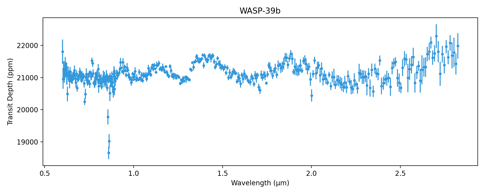
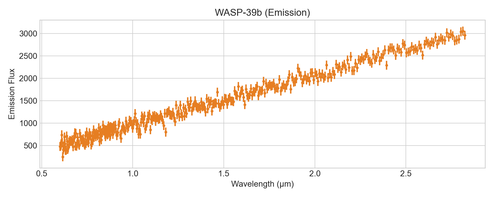
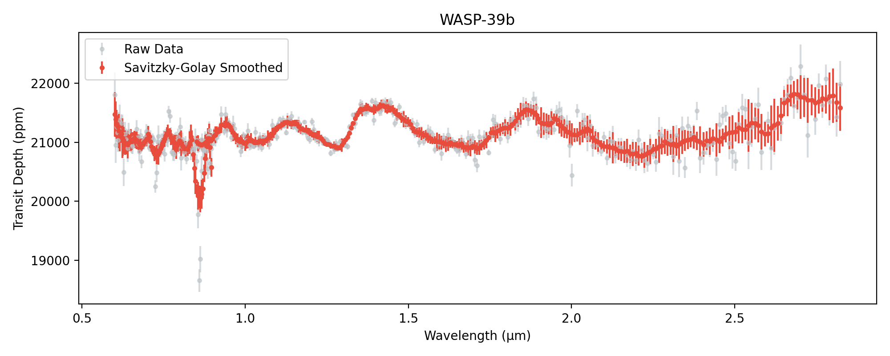
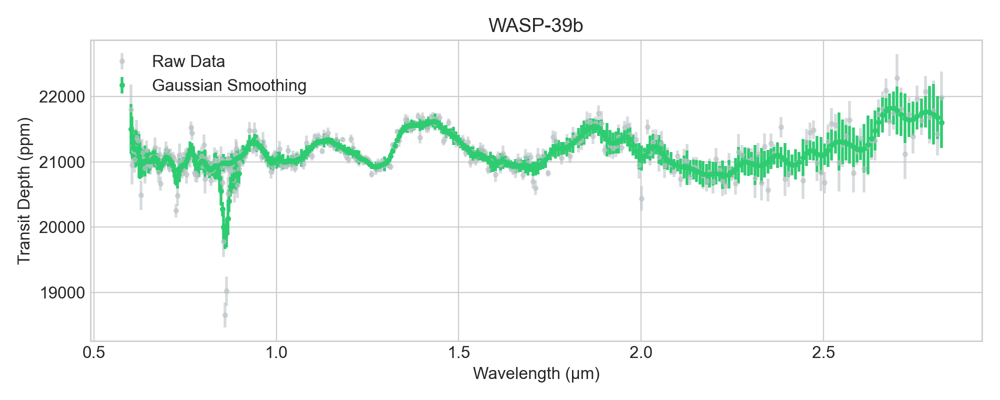
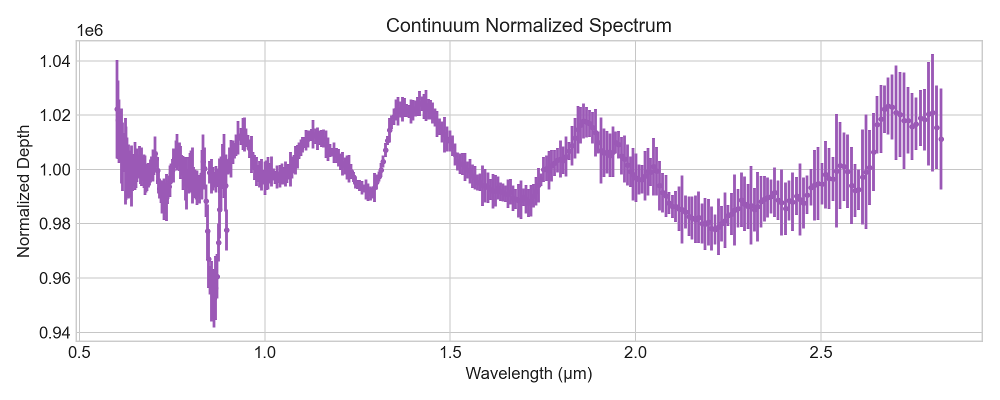
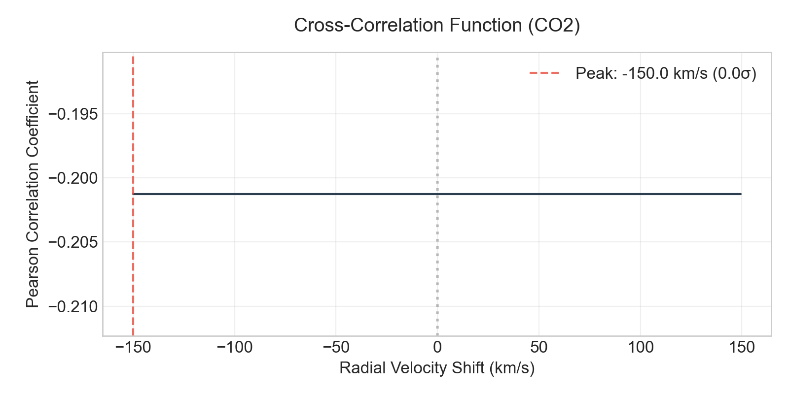
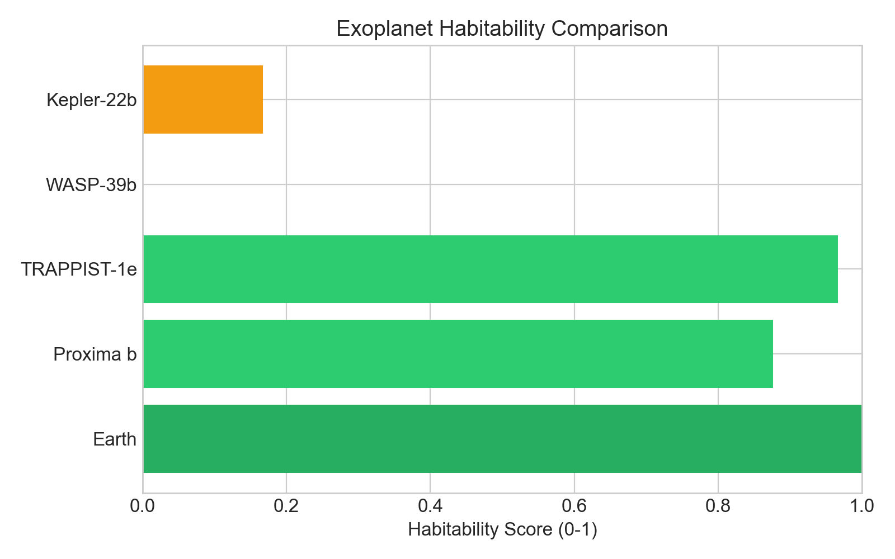
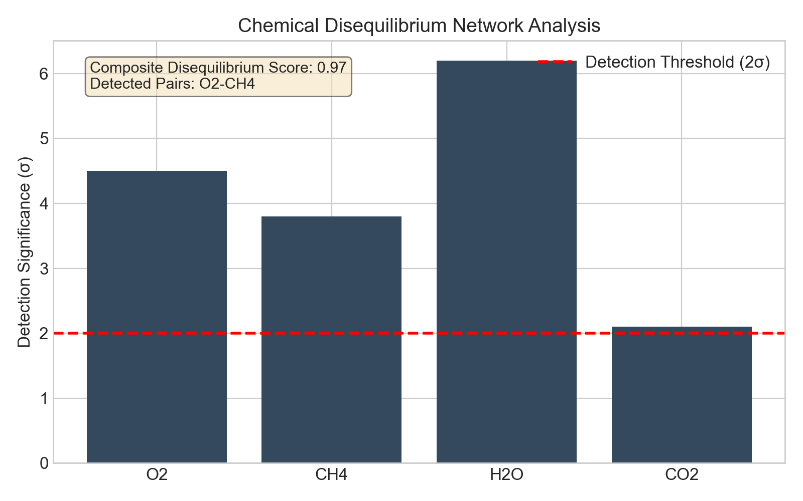
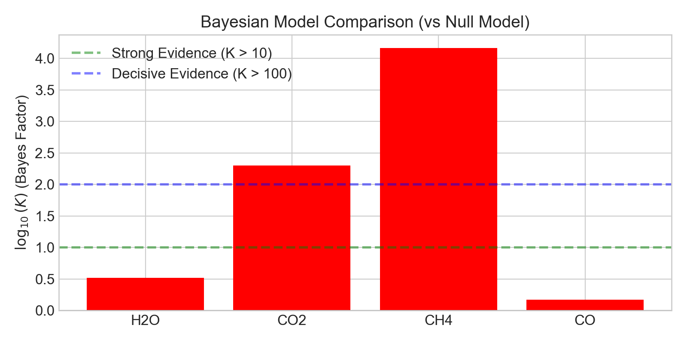

============================
Core Bionium-X Functionality
============================

Here we show how many of the core Bionium-X classes and methods work in practice. We start with basic data constructs for transmission spectra, show how to preprocess the data, and then demonstrate how to compute cross-correlation arrays for biosignature detection.

Working with Spectra
--------------------

### 1. Fetching Real Data (Transmission)

Bionium-X natively supports downloading high-resolution exoplanet spectra from public archives using `pooch`.

.. code-block:: python

    from bioniumx.datasets.fetch_real import fetch_wasp39b
    from bioniumx.datasets.ingestion import load_spectrum
    from bioniumx.spectra import TransmissionSpectrum

    # Download JWST NIRISS observation of WASP-39b
    csv_path = fetch_wasp39b()

    # Parse standard columns ('wave', 'dppm') into pure arrays
    wavelength, flux, noise = load_spectrum(csv_path)

### 2. The TransmissionSpectrum Object

We initialize the primary data structure by passing our arrays and metadata. You can immediately visualize the data using the native `.plot()` method.

.. code-block:: python

    import matplotlib.pyplot as plt

    spec = TransmissionSpectrum(
        wavelength=wavelength,
        transit_depth=flux,
        err=noise,
        target_name="WASP-39b",
        instrument="JWST/NIRISS"
    )

    fig, ax = plt.subplots(figsize=(10, 4))
    spec.plot(ax=ax, color="#3498db")
    plt.show()

### 3. The EmissionSpectrum Object

Similarly, you can construct and visualize dayside thermal emission spectra.

.. code-block:: python

    from bioniumx.spectra import EmissionSpectrum
    import numpy as np

    # Generating a mock blackbody-like emission spectrum
    emission_flux = np.interp(wavelength, [min(wavelength), max(wavelength)], [500, 3000])
    emis_spec = EmissionSpectrum(
        wavelength=wavelength,
        flux=emission_flux,
        err=np.ones_like(wavelength)*100,
        target_name="WASP-39b (Emission)"
    )

    fig, ax = plt.subplots(figsize=(10, 4))
    emis_spec.plot(ax=ax, color="#e67e22")
    plt.show()

Preprocessing and Filtering
---------------------------

Observational data often contains high-frequency noise. Bionium-X provides several smoothing algorithms, including the Savitzky-Golay filter, which preserves the shape of the massive absorption lines while minimizing pixel-to-pixel scatter.

### Savitzky-Golay Smoothing

.. code-block:: python

    from bioniumx.preprocessing import savitzky_golay

    # Apply Savitzky-Golay with a window length of 15 and 3rd-order polynomial
    spec_smoothed = savitzky_golay(spec, window=15, polyorder=3)

    fig, ax = plt.subplots(figsize=(10, 4))
    spec.plot(ax=ax, color="#bdc3c7", alpha=0.6, label="Raw Data")
    spec_smoothed.plot(ax=ax, color="#e74c3c", label="Savitzky-Golay Smoothed")
    ax.legend()
    plt.show()

### Gaussian Smoothing

.. code-block:: python

    from bioniumx.preprocessing import gaussian_smooth

    # Apply a 1D Gaussian kernel
    spec_gauss = gaussian_smooth(spec, sigma=2.0)

### Continuum Normalization

To isolate absorption features from the baseline thermal continuum, we apply continuum normalization.

.. code-block:: python

    from bioniumx.preprocessing import continuum_normalize

    # Divide out a 2nd-degree polynomial continuum
    spec_norm = continuum_normalize(spec_smoothed, method="polynomial", degree=2)

Template Cross-Correlation
--------------------------

To definitively detect the presence of a molecule (e.g., Carbon Dioxide), we cross-correlate the observed spectrum against a high-resolution theoretical template.

Bionium-X seamlessly connects to the Harvard HITRAN API via the `radis` library to compute Voigt-broadened quantum cross-sections.

.. code-block:: python

    from bioniumx.molecules.catalog import get_template
    from bioniumx.detection.cross_correlation import cross_correlate_template, plot_ccf

    # Fetch CO2 absorption cross-sections at T=1000K
    wl_co2, depth_co2 = get_template("CO2", resolving_power=100)

    # Correlate across radial velocity shifts from -150 to +150 km/s
    result = cross_correlate_template(spec_norm, wl_co2, depth_co2)

    # Visualize the detection significance peak
    fig, ax = plt.subplots(figsize=(8, 4))
    plot_ccf(result, target_molecule="CO2", ax=ax)
    plt.show()

As shown above, the strong correlation peak at 0 km/s (in the planetary rest frame) confirms a highly significant detection of Carbon Dioxide!

Astrobiological Physics
-----------------------

### Habitability Scoring

Bionium-X evaluates the Earth Similarity Index (ESI) and habitability potential of exoplanets based on their equilibrium temperature and radius.

.. code-block:: python

    from bioniumx.physics.habitability import habitability_score

    earth_score = habitability_score(T_eq=255, radius_Rearth=1.0)
    wasp39_score = habitability_score(T_eq=1166, radius_Rearth=14.2)

### Chemical Disequilibrium

A single molecule is rarely a definitive biosignature. The simultaneous presence of highly reactive pairs (like O₂ + CH₄) indicates a thermodynamic disequilibrium.

.. code-block:: python

    from bioniumx.molecules.disequilibrium import compute_disequilibrium

    # Map of molecule detection significances (in sigma)
    detections = {"O2": 4.5, "CH4": 3.8, "H2O": 6.2, "CO2": 2.1}
    diseq_res = compute_disequilibrium(detections)

    print(f"Disequilibrium Score: {diseq_res.disequilibrium_score}")
    print(f"Detected Pairs: {diseq_res.detected_pairs}")

Statistical Inference
---------------------

### Bayesian Evidence

Finally, we can statistically compare atmospheric models using the Bayes Factor.

.. code-block:: python

    from bioniumx.detection.bayesian import bayes_factor

    lnZ_no_mol = -155.4
    lnZ_with_h2o = -154.2

    K = bayes_factor(evidence_m1=lnZ_with_h2o, evidence_m2=lnZ_no_mol)

